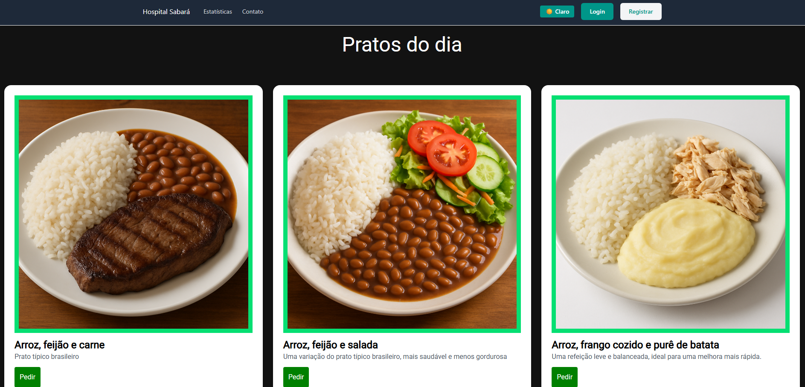
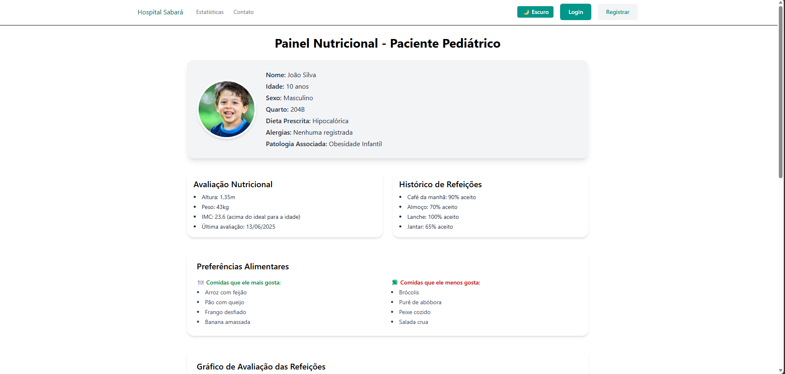
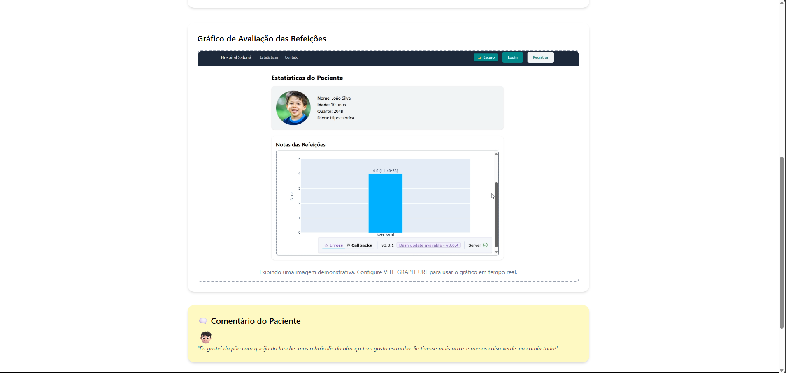
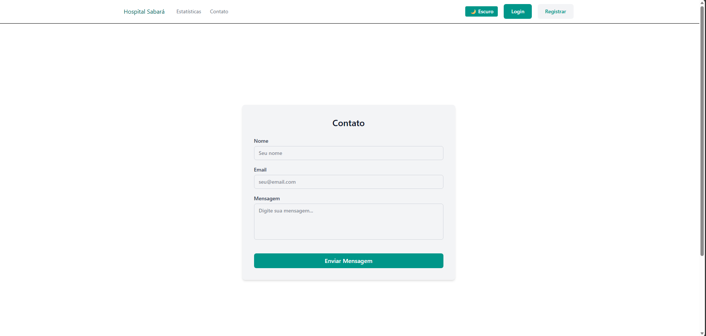
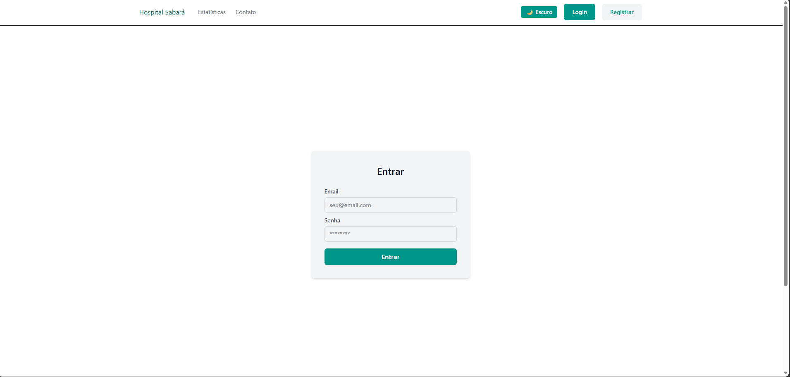
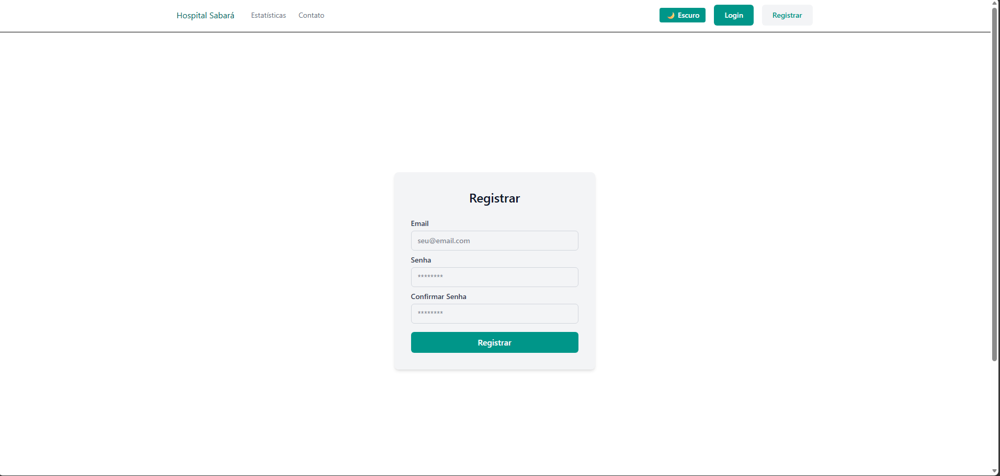

# Hospital Sabará — Painel Nutricional Pediátrico

Aplicação web acadêmica para apresentação do cardápio hospitalar e acompanhamento nutricional de pacientes pediátricos. O projeto combina uma interface React responsiva com uma API Express que fornece as refeições cadastradas em JSON.

## Funcionalidades

- Cardápio do dia carregado pela API.
- Painel com informações e avaliação nutricional do paciente.
- Histórico de aceitação e preferências alimentares.
- Gráfico nutricional externo com imagem demonstrativa como fallback.
- Tema claro e escuro.
- Formulários de login, cadastro e contato com validação local.
- Página de erro 404.
- Layout responsivo.

## Demonstração

### Cardápio do dia

[](./docs/screenshots/cardapio-tema-escuro.png)

### Acompanhamento nutricional

[](./docs/screenshots/painel-nutricional.png)

[](./docs/screenshots/grafico-e-comentario.png)

### Formulários

| Contato | Login | Cadastro |
| --- | --- | --- |
| [](./docs/screenshots/contato.png) | [](./docs/screenshots/login.png) | [](./docs/screenshots/cadastro.png) |

## Tecnologias

### Frontend

- React 19
- React Router 7
- Vite 6
- Tailwind CSS 4
- Axios

### Backend

- Node.js
- Express 5
- CORS
- Arquivo JSON como fonte de dados
- Test runner nativo do Node.js

## Pré-requisitos

- Node.js 18 ou superior
- npm

## Instalação e execução

O frontend e o backend devem ser executados em terminais separados.

### Backend

```bash
cd backend
npm install
npm run dev
```

A API ficará disponível em `http://localhost:3000`.

Para executá-la sem recarregamento automático:

```bash
npm start
```

### Frontend

```bash
cd frontend
npm install
npm run dev
```

O Vite mostrará no terminal o endereço da aplicação, normalmente `http://localhost:5173`.

## Configuração do frontend

A aplicação funciona com valores padrão em desenvolvimento. Para personalizar os endereços dos serviços, copie `frontend/.env.example` para `frontend/.env` e ajuste:

```env
VITE_API_URL=http://localhost:3000
# VITE_GRAPH_URL=http://127.0.0.1:5000
```

- `VITE_API_URL`: endereço da API de refeições.
- `VITE_GRAPH_URL`: endereço opcional do gráfico em tempo real. Se não for definido, a aplicação exibe a imagem demonstrativa incluída no projeto.

Após alterar o arquivo `.env`, reinicie o servidor do Vite.

## API

### Listar refeições

```http
GET /refeicoes
```

Exemplo de resposta:

```json
[
  {
    "id": 1,
    "imagem": "/arroz-feijao-carne.png",
    "refeicao": "Arroz, feijão e carne",
    "descricao": "Prato típico brasileiro"
  }
]
```

Os registros estão em `backend/data/cardapio.json`.

## Rotas da aplicação

| Rota | Conteúdo |
| --- | --- |
| `/` | Cardápio do dia |
| `/Login` | Formulário de login |
| `/Registrar` | Formulário de cadastro |
| `/Estatistica` | Painel nutricional |
| `/Contato` | Formulário de contato |
| Demais rotas | Página 404 |

## Scripts disponíveis

### Frontend

| Comando | Descrição |
| --- | --- |
| `npm run dev` | Inicia o Vite em modo de desenvolvimento |
| `npm run build` | Gera a versão de produção |
| `npm run preview` | Visualiza localmente o build de produção |
| `npm run lint` | Analisa o código com ESLint |

### Backend

| Comando | Descrição |
| --- | --- |
| `npm run dev` | Inicia a API com recarregamento automático |
| `npm start` | Inicia a API com Node.js |
| `npm test` | Executa o teste do endpoint de refeições |

## Estrutura do projeto

```text
SPRINT4_WebDev-main/
├── docs/
│   └── screenshots/
├── backend/
│   ├── data/
│   │   └── cardapio.json
│   ├── test/
│   │   └── refeicoes.test.js
│   ├── package.json
│   └── server.js
├── frontend/
│   ├── public/
│   ├── src/
│   │   ├── assets/
│   │   ├── components/
│   │   ├── routes/
│   │   ├── App.jsx
│   │   └── main.jsx
│   ├── .env.example
│   ├── package.json
│   └── vite.config.js
└── README.md
```

## Limitações conhecidas

- O projeto é um protótipo acadêmico: login, cadastro, contato e pedidos validam ou simulam ações na interface, mas não possuem autenticação nem persistência.
- O serviço que gera o gráfico em tempo real não faz parte deste repositório; na ausência dele, é exibida uma imagem demonstrativa.
- A cobertura automatizada atual verifica o contrato principal da API, mas ainda não contempla os componentes do frontend.

## Autores

**Stack Society**

- Vitor de Lima Domingues 
- Giovanni Romano Provazi 
- João Pedro Vieira de Morais 